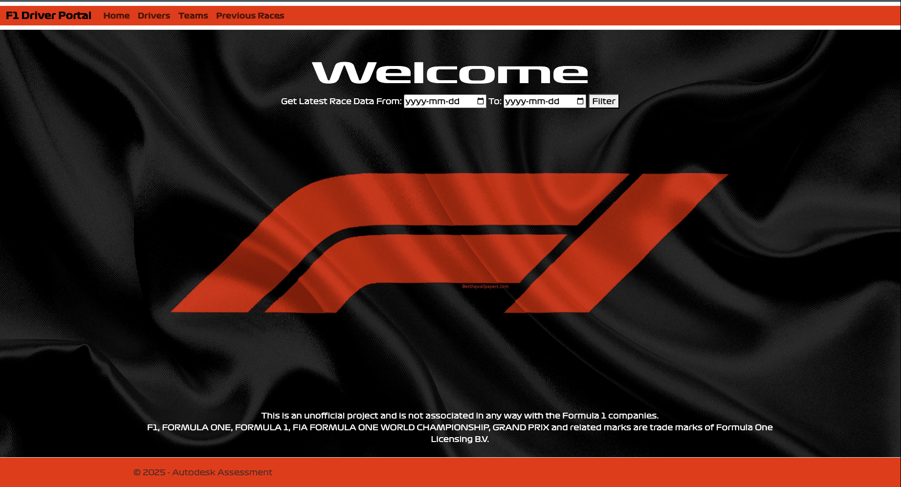
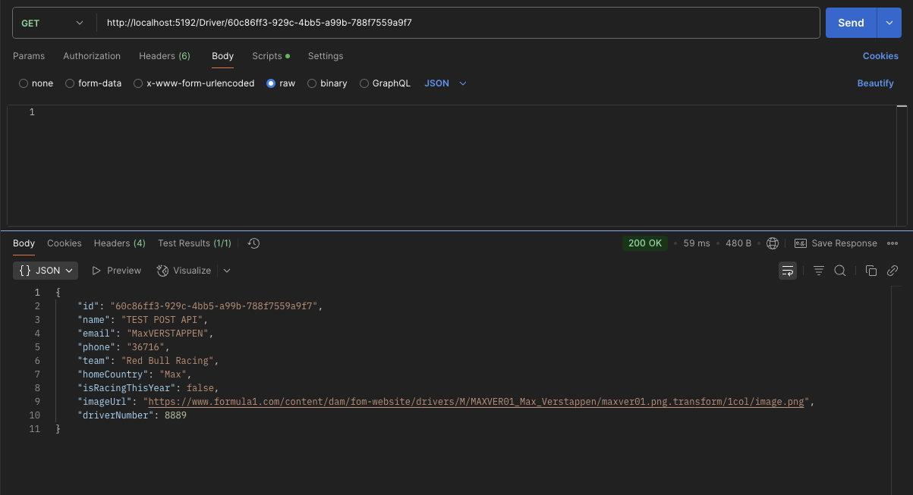
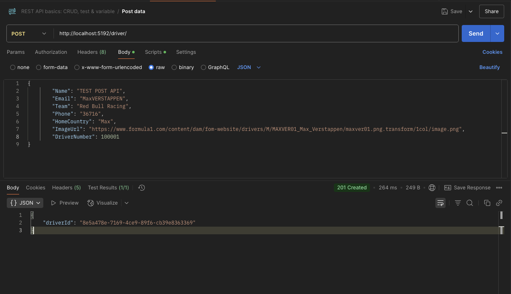
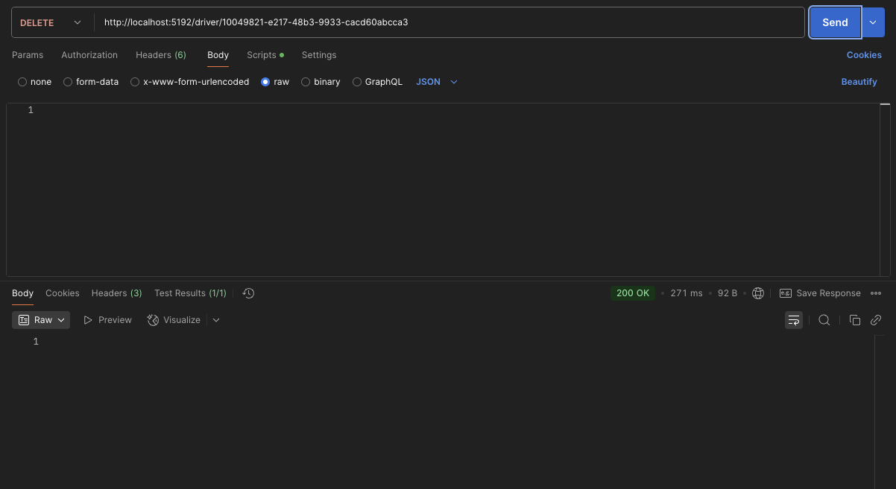
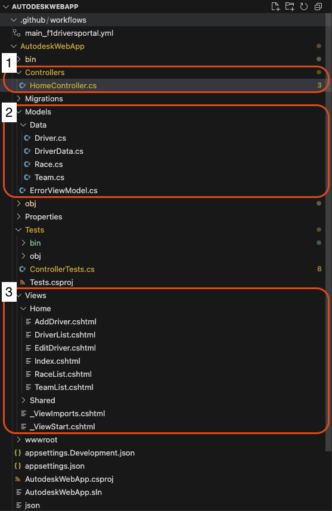
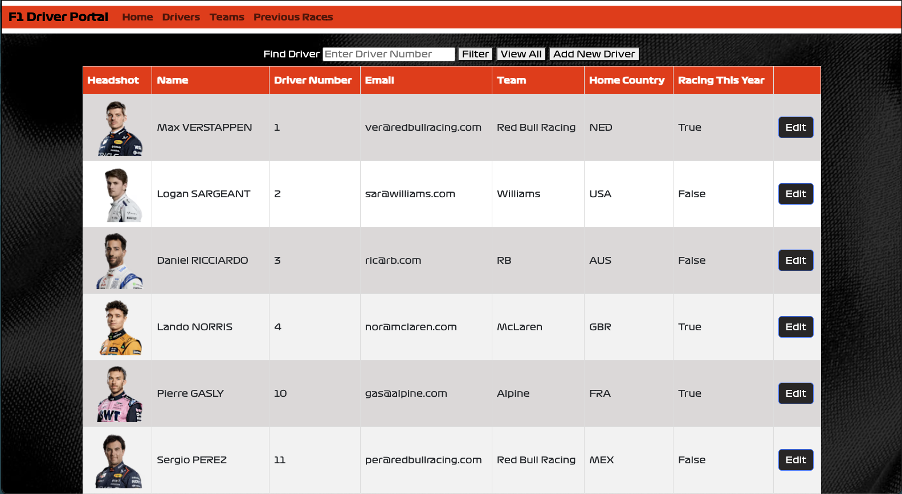
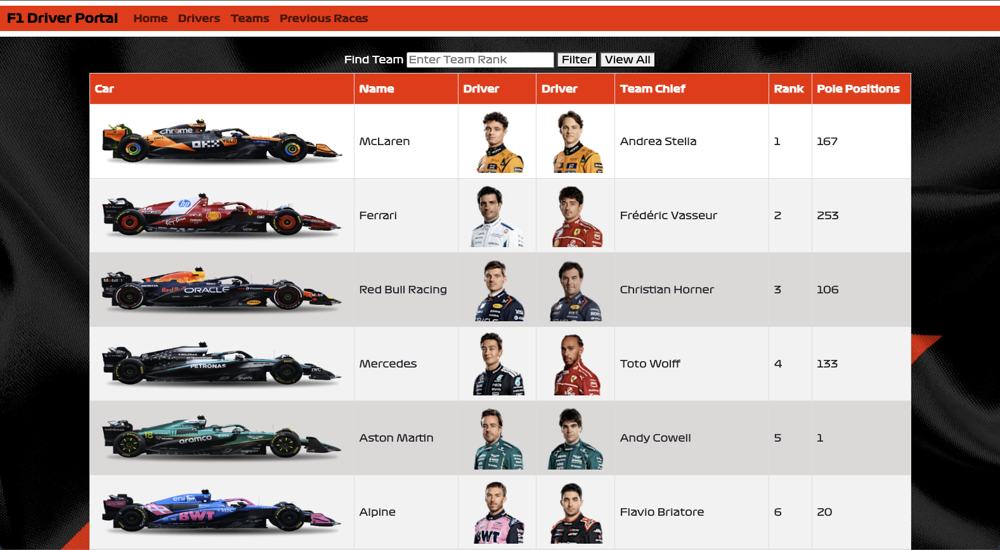
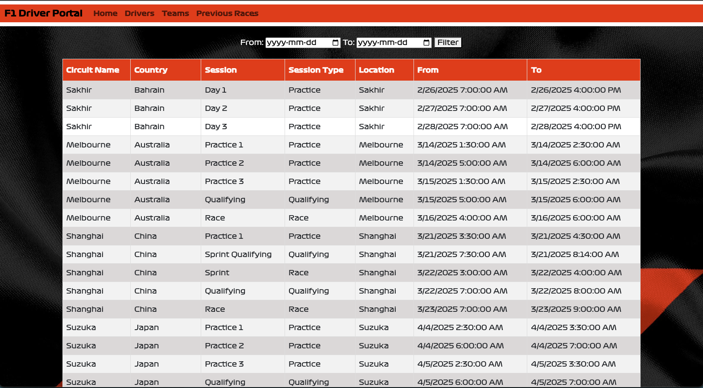

 

<!-- TITLE -->

  <h1 align="center">Formula One Driver Portal</h1>   
  <h3 align="center">Autodesk Development Task</h3> 

<!-- TABLE OF CONTENTS -->

  <h2>Table of Contents</h2>
  <ol>
    <li>
      <a href="#about-the-project">About The Project</a>
    </li>
    <li>
      <a href="#project-overview">Project Overview</a>
      <ul>
        <li><a href="#functionality">Functionality</a></li>
        <li><a href="#architecture">Architecture</a></li>
        <li><a href="#web-pages">Web Pages</a></li>
        <li><a href="#data">Data</a></li>
          <ul>
            <li><a href="#sql-database">SQL Database</a></li>
            <li><a href="#csharp-data-classes">C# Data Classes</a></li>
          </ul>
      </ul>
      <li>
        <a href="#project-planning-and-future-improvements">Project Planning and Future Improvements</a>
      </li>  
      <li>
        <a href="#notes-for-testing">Notes For Testing</a>
      </li>
  </ol>

<!-- Portal Home Page -->

<!-- ABOUT THE PROJECT -->

# About The Project
This is a .NET Web Application that supports `Create`, `Read`, `Update` and `Delete` (CRUD) operations for Formula One driver data.
The application is built using C#, HTML, CSS, SQL, following the Model-View-Controller (MVC) architecture.
The project is deployed using GitHub Actions to Microsoft Azure.
 
To explore the Formula One Driver Portal, simply click the image above or [visit the portal here](https://f1driversportal-bpbzhjebbfahe5fj.canadacentral-01.azurewebsites.net/). 
 
  > NOTE: I suggest reading the [Notes For Testing](#notes-for-testing) section for known limitations.

More details can be found in the <a href="#project-overview">Project Overview</a> section below.

(<a href="#readme-top">back to top</a>)

<!-- PROJECT OVERVIEW -->
# Project Overview
The Formula One Driver Portal is divided into four distinct [web pages](#web-pages), each with its own features for accessing and updating data. Some data is stored in SQL database, some is retrieved from a public API and a small portion is stored on Azure Blob Storage. The following sections provide a detailed breakdown of each part of the project.

  ## APIs ***[Added May 12]***
  The following APIs are working on local host (as seen in screenshots below). WIP to fix these on the live website
  - View Driver API: /driver/{driverID} 
      
  - Add Driver API:  /driver/{driver}
      
  - Delete Driver API: /driver/{driverID}
      

  ### Tech Stack
  - **Web App** - HTML, CSS, .NET
  - **Back End** - SQL Server, Microsoft Azure
  - **Source Code and CI/CD** - GitHub Actions

## Functionality
The user can access the following functionalities on the portal: 
1. **Drivers** - Add a new driver, view all drivers, delete driver, modify driver data, find a driver using their `Driver Number` (note: this number doesn't have to be unique).
    - Drivers data is stored in Azure SQL Database. All changes are saved directly to the database table.  
2. **Teams** - View team data and find team using `Team Rank`.
    - Team data is also saved in the Azure SQL database. There is no option to edit it from the portal.
3. **Races** - View all the race sessions or filter within a specific time window.
    - This data is retrieved in real-time from a public API [https://api.openf1.org/v1/sessions].

(<a href="#readme-top">back to top</a>)

## Architecture

  

  
 
  The application follwos the Model-View-Controller acrchitecture, as seen in the project layout:
  1. **Controllers** - this folder contains the `HomeController` class, which is responsible for handling HTTP requests and communiates between Model and View.
  2. **Models** - represents the application's data structure, descibed in detail in the [C# Data Classes](#csharp-data-classes) section.
  4. **Views** - all the shared and individual HTML/CSS Razor views can be found in this folder.

(<a href="#readme-top">back to top</a>)

 ## Web Pages
  The portal is divided in 4 pages:
 1. **Home**
 
    - This is the welcome screen. You'll find a `From` and `To` date prompts to filter latest race session data.
    - `Filter` button-click redirects you to `Previous Races` page.
    - If no dates are selected, it will automatically retrieve the entire json (sessions starting from 2023 till today).

 2. **Drivers**
 
    - This page displays all drivers by default.
    - You can find drivers by entering their `Driver Number` in the input field. If the `Driver Number` doesn't exist, it displays an empty table.
    - You can also `Add Driver` and `View All` drivers on this page.
    - In every row, you'll find an `Edit` button, which takes you to the `Edit Driver` page.
    - The `Edit Driver` page supports the following functionalities:
      - `Submit` - writes the changes the the database and redirects to Drivers page.
      - `Reset` - Clears the changes you made to the form. Original data remains the same.
      - `Cancel` - Stashes your changes and redirects to Drivers page. 
      - `Delete Driver` - This button is slightly hidden and you need to scroll all the way down to the page to see it. On click, shows you a prompt to confirm deletion and then deletes the driver. Also redirects to Drivers page.

 3. **Teams**
  
    - This page displays all teams by default.
    - You can filter teams by `Team Rank`.
    - There are only 10 teams in F1, hence 1 to 10 ranks. 0 shows all teams and any other number less than 0 and more than displays an empty table.
    - Clicking on the `driver image` in this table takes you to that driver's information page.

 4. **Previous Races**
   
    - This page displays all the race sessions using the https://api.openf1.org/v1/sessions API.
    - The earliest available race is from 2023 and the latest is updated every weekend after the race.
    - You can filter the race from a `start date` to `end date`. Shows an empty table is there are no races in the date range.
    - It shows an error if you select `start date` later than `end date`.
    - A future `end date` is also accepted.

  > UI Restrictions:  
    - The `DriverNumber`, `Find Team` fields only allow numbers. 
    - Edit and Add Driver form fields also allows only numbers in `Phone` and `Driver Number` fields. 
    - If you resize the browser window to really slim (to match mobile device), the Drivers page and Teams page tables shrink to only display the important columns. 

(<a href="#readme-top">back to top</a>)

 ## Data
  ### SQL Database
  The SQL Database consists of two tables:
  1. Drivers Table: 
      The data in this table was populated once, using the `HomeController.InitDatabase()` by deserializing the json data from Open F1's public API: https://api.openf1.org/v1/drivers
       Constraints:
        - Each driver has a unique ID. 
        - The DriverNumber can be same for multiple drivers. 
        
       
        
      `Drivers`  
      | Column | Description |
      | --- | --- |
      [Id]               |   UNIQUEIDENTIFIER NOT NULL
      [Name]             |   VARCHAR (100)    NOT NULL
      [Email]            |   VARCHAR (200)    NULL
      [Phone]            |   VARCHAR (10)     NULL
      [Team]             |   VARCHAR (100)    NOT NULL
      [HomeCountry]      |   VARCHAR (100)    CONSTRAINT [DEFAULT_Drivers_HomeCountry] DEFAULT ((200)) NULL
      [IsRacingThisYear] |   BIT  CONSTRAINT [DEFAULT_Drivers_IsRacingThisYear] DEFAULT ((0)) NULL
      [ImageUrl]         |   VARCHAR (3000)  NULL
      [DriverNumber]     |   INT NULL

  2. Teams Table
      This table contains information about the 10 F1 teams of 2024 season. The data in this table was populated manually.

       
      
      `Teams`
      | Column | Description |
      | --- | --- |
      [Id]              |   UNIQUEIDENTIFIER NOT NULL
      [Name]            |   VARCHAR (100)    NOT NULL
      [Driver1]         |   UNIQUEIDENTIFIER NULL
      [Driver2]         |   UNIQUEIDENTIFIER NULL
      [TeamChief]       |   VARCHAR (100)    NOT NULL
      [CarImageUrl]     |   VARCHAR (3000)   NULL
      [Rank]            |   INT              NULL
      [PolePositions]   |   INT              NULL

  > All the driver headshot images are public URLs, stored as `ImageUrl` in the `Drivers` database.
    The team car images are stored on my Azure Blob Storage and their SAS token URIs are stored in the `Teams` database.

  ## C# Data Classes
  The .Net project has five data classes: 
  1. Driver - used to map driver data from the database. Same fields as the database.
  2. JsonDriverData - this was used to deserialize data from the drivers API, which was then used to populate the SQL `Drivers` table.
  3. Race - used for race session data. The API json data is deserialized into Race object.
  4. Team - this is same as the Team SQL table fields.
  5. TeamView - the `Team` object data is converted to `TeamView` object for displaying on the Teams page.

(<a href="#readme-top">back to top</a>)

# Project Planning and Future Improvements
I planned the project exactly how I plan my sprint tasks. The problem statement broken down into smaller tasks and tracked in [this](https://docs.google.com/document/d/1U_YXLZXRqzGaEwI18pGToT0tDoPowE4YB4wJekQ7rlA/edit?usp=sharing) Google Document.
The tasks were sorted in decreasing priority order and were updated if an unforeseen issue or feature came up.
I tracked my task progress using a checklist (similat to a Sprint board). 

Some tasks were stretch goals - marked as *Bonus*.
> Best practice - I add comment summary to my Github commits that contain a large change-set. The summary is helpful for creating release notes and detailed Pull Request descriptions.

Future Improvements
  - User authentication.
  - Live race data (team positions and driver lap times) on home page.
  - Find Driver and Teams by name.
  - Edit Team and Add Team features.
  - More test cases to cover model controller.
  - Fix the Github CI/CD test actions.

(<a href="#readme-top">back to top</a>)

# Notes For Testing
  I tried to test all possible scenarios and edge cases. Please note that there is no user authentication at the moment, which gives everyone access to add and delete to the database directly.
  Here's a list of suggested test scenarios (happy path and edge cases) and known limitations:  
  
  - Add
      - Add a driver with all valid inputs. 
      - Add a driver with some missing fields or invalid inputs (e.g: enter characters in phone number field).
      - Add a driver by going to `/Home/AddDriver`.
  - Edit
    - Open a driver's edit page and delete the same driver on a different tab. It should redirect you to the error page with error message `Driver not found`.
    - Enter some details and `Reset` them.
  
  - Delete
    - Open the edit page of the same driver in two tabs and delete it. The second delete action should redirect you to the error page with error message `Driver doesn't exist.`.
  
  - Race Sessions
    - Trying today's start-date and a past end-date.

  - Find
    - Filtering team and/or driver with a negative or a random number.

  - UI
    - Decreasing the browser width on Desktop should hide columns on `Drivers` and `Teams` table to only show important columns.

  - Tested Environments
    - Browsers - Chrome, Safari
    - Desktop - 49" curved monitor
    - Laptop - 13" MacBook Air
    - Mobile - iPhone 16 Pro 

  ### Known Limitations 
  - The UI is not mobile-friendly. Some elements may appear misaligned.
  - The `Delete Driver` button is located at the bottom of the screen, which can be easily missed.
  - The Race Sessions API sometime takes long to respond. If you see server errors, page refresh should fix it.
  - Team car images may not load on first try.

(<a href="#readme-top">back to top</a>)

